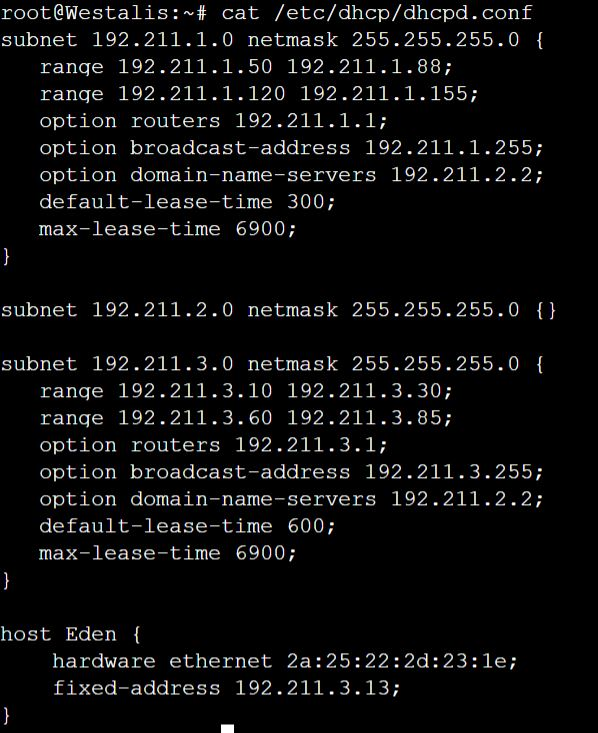
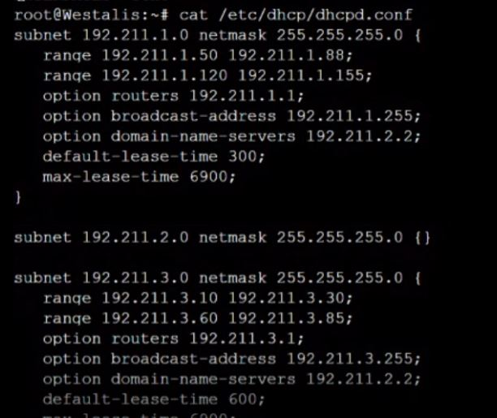

# Jarkom-Modul-3-ITA02-2022

## Hasil Pengerjaan Modul 1 Praktikum Komunikasi Data & Jaringan Komputer 2022

Anggota Kelompok ITA02:
1. Muhammad Faris Anwari (5027201008)
2. Calvindra Laksmono Kumoro (5027201020)
3. Adinda Putri Audyna (5027201073)

Dibuat topologi seperti berikut ini:


---
### Soal No 1
Loid bersama Franky berencana membuat peta tersebut dengan kriteria WISE sebagai DNS Server, Westalis sebagai DHCP Server, Berlint sebagai Proxy Server (1).

### Jawaban No 1
Pertama pada bagian Wise kita dapat lihat pada `cat /etc/dhcp/dhcpd.conf`.


Disitu dapat dilihat  pada `option domain-name-servers 192.211.2.2` itu mengarah ke WISE karena diminta WISE sebagai DNS server.

Di WISE, kita menuliskan `/etc/bind/named.conf.options` sebagai berikut


```
forwarders {
        192.168.122.1;
}
```
Bagian disini menandakan bahwa WISE mengforward request DNS ke IP yang pertama didapat saat konfigurasi awal topologi yang diperoleh dengan `iptables -t nat -A POSTROUTING -o eth0 -j MASQUERADE -s 192.211.0.0/16`, sehingga node-node lain bisa mengakses internet. Tak lupa kita meng-*comment* `dnssec-validation auto` serta menambahkan baris `allow-query{any;};`

Pada web console Westalis, kita dapat membuat Westalis menjadi DHCP Server dengan mengatur scripting terlebih dahulu melalui `nano westalis.sh`


Kita perlu pastikan kita sudah menginstall dhcp server dan sudah melakukan config terlebih dahulu pada Westalis, yakni dengan menuliskan dhcpd.conf serta isc-dhcp-server yang sesuai dengan kriteria soal selanjutnya. Setelah ditulis, isi file tersebut kita timpakan/overwrite di tempat yang asli, yakni di `/etc/dhcp/dhcpd.conf` dan `/etc/default/isc-dhcp-server`.
    



Setelah file-file yang relevan sudah dioverwrite, kita dapat melakukan `service isc-dhcp-server restart`. Adapun isi file-file akan dijelaskan pada nomor-nomor dibawah.

Tak lupa pada tiap node client, kita lakukan `nano /etc/network/interfaces` dan tuliskan sebagaimana berikut:

```
auto eth0
iface eth0 inet dhcp
```

Sehingga IP client tidak statis sebagaimana di modul-modul sebelumnya tapi tergantung konfigurasi kita kali ini.

---
### Soal No 2
dan Ostania sebagai DHCP Relay (2).


### Jawaban No 2
Kita memasukkan beberapa perintah dan syarat  agar Ostania bisa menjadi DHCP Relay, yaitu kita perlu melakukan konfigurasi awal pada Ostania kemudian mengbash perintah-perintah berikut:

```sh
apt-get update
apt-get install isc-dhcp-relay -y
service isc-dhcp-relay restart
```

Adapun ketika mengbash `apt-get install isc-dhcp-relay -y`, kita perlu menjawab beberapa requirement relay.


> Servers the DHCP relay should forward requests to:

Jawab dengan IP DHCP Server. Pada kasus ini, IP Westalis sebagai DHCP Server ialah `192.211.2.4`.

> Interfaces the DHCP relay should listen on:

Dapat kita lihat di topologi bahwa Ostania melayani kebutuhan host-host di switch 1 hingga 3, maka interfaces yang relevan ialah eth1, eth2 dan eth3.

Selebihnya tinggal enter, lalu `service isc-dhcp-relay restart`.

---
### Soal No 3
Loid dan Franky menyusun peta tersebut dengan hati-hati dan teliti. Ada beberapa kriteria yang ingin dibuat oleh Loid dan Franky, yaitu:
1. Semua client yang ada HARUS menggunakan konfigurasi IP dari DHCP Server.
2. Client yang melalui Switch1 mendapatkan range IP dari [prefix IP].1.50 - [prefix IP].1.88 dan [prefix IP].1.120 - [prefix IP].1.155 (3).

### Jawaban No 3
1. Semua client yang ada harus menggunakan konfigurasi IP dan DHCP Server, untuk persisnya sesuai penjelasan di bawah.
2. Client yang melalui Switch1 mendapatkan range IP dari [prefix IP].1.50 - [prefix IP].1.88 dan [prefix IP].1.120 - [prefix IP].1.155.

Bisa kita lihat melalui `cat /etc/dhcp/dhcpd.conf` pada web console westalis
    


Pengaturan sudah sesuai dengan yang diminta, dimana pada `subnet 192.211.1.0` atau pada host-host di Switch1, mereka akan mendapatkan IP dengan range yang sesuai.

Sebagai bukti sesuainya konfigurasi, kita cek `ip a` di node SSS sebagai salah satu host di Switch1.


Terlihat bahwa IP sudah sesuai kriteria.

---
### Soal No 4
Client yang melalui Switch3 mendapatkan range IP dari [prefix IP].3.10 - [prefix IP].3.30 dan [prefix IP].3.60 - [prefix IP].3.85 (4).

### Jawaban No 4
Tambahkan ketentuan berikut ini pada file /etc/dhcp/dhcp.conf dengan command `cat  /etc/dhcp/dhcp.conf` di web console westalis:
1. Atur subnet 192.211.3.0 (berarti semua yg diatur di switch 3)
2. Atur range 192.211.3.10 sampai 192.211.3.30 dan 192.211.3.60 sampai 192.211.3.85 sesuai perintah soal
3. Atur options routersnya 192.211.3.1 karna itu merupakan address ke switch 3
4. Atur options broadcast-address 192.211.3.255 karna dalam 1 oktet paling besar 255


Sebagai bukti sesuainya konfigurasi, kita cek `ip a` di node Eden sebagai salah satu host di Switch1.


Terlihat bahwa IP sudah sesuai kriteria.

---
### Soal No 5
Client mendapatkan DNS dari WISE dan client dapat terhubung dengan internet melalui DNS tersebut (5).

### Jawaban No 5
Tambahkan ketentuan berikut ini pada file /etc/dhcp/dhcp.conf dengan command `cat /etc/dhcp/dhcp.conf` di web console westalis:
1. Atur option domain-name-servers 192.211.2.2 sehingga client mendapatkan DNS dari WISE dan client dapat terhubung dengan internet melalui DNS tersebut


---
### Soal No 6
Lama waktu DHCP server meminjamkan alamat IP kepada Client yang melalui Switch1 selama 5 menit sedangkan pada client yang melalui Switch3 selama 10 menit. Dengan waktu maksimal yang dialokasikan untuk peminjaman alamat IP selama 115 menit (6).

### Jawaban No 6
Tambahkan ketentuan berikut ini pada file /etc/dhcp/dhcp.conf dengan command `cat  /etc/dhcp/dhcp.conf` di web console westalis:
1. Atur default-lease-time 600 karna diminta client yang melalui Switch3 selama 10 menit (sama dengan 600 detik) 
2. Atur max-lease-time 6900 karna waktu maksimalnya 115 menit (sama dengan 6900 detik)


Jadi kurang lebih isi dari file `/etc/dhcp/dhcp.conf` pada web console westalis adalah sebagai berikut:


---
### Soal No 7
Loid dan Franky berencana menjadikan Eden sebagai server untuk pertukaran informasi dengan alamat IP yang tetap dengan IP [prefix IP].3.13 (7).

### Jawaban No 7
Soal ini meminta kita membuat fixed address di Eden. Di node Westalis, cek lagi isi /etc/dhcp/dhcpd.conf.


Terlihat bahwa sebagaimana no 1 di atas jelaskan, kita sudah menginclude konfigurasi yang mengatur Eden dengan fixed address. Adapun pada baris

    hardware ethernet 2a:25:22:2d:23:1e;

Address tersebut kita dapatkan dari mengulik console Eden itu sendiri. Bila kita cek `ip a` di node Eden:


Kita cek di bagian eth0 dan kita dapati hardware addressnya yakni `2a:25:22:2d:23:1e`. Adapun agar hardware address Eden selalu demikian, kita atur di /etc/network/interfaces, tambahkan

```
hwaddress ether 2a:25:22:2d:23:1e
```

di bawah baris-baris yang mengatur DHCP, sehingga hardware address sudah pasti demikian.

---
### Soal No 8
SSS, Garden, dan Eden digunakan sebagai client Proxy agar pertukaran informasi dapat terjamin keamanannya, juga untuk mencegah kebocoran data.
Pada Proxy Server di Berlint, Loid berencana untuk mengatur bagaimana Client dapat mengakses internet. Artinya setiap client harus menggunakan Berlint sebagai HTTP & HTTPS proxy. Adapun kriteria pengaturannya adalah sebagai berikut:
1. Client hanya dapat mengakses internet diluar (selain) hari & jam kerja (senin-jumat 08.00 - 17.00) dan hari libur (dapat mengakses 24 jam penuh)
2. Adapun pada hari dan jam kerja sesuai nomor (1), client hanya dapat mengakses domain loid-work.com dan franky-work.com (IP tujuan domain dibebaskan)
3. Saat akses internet dibuka, client dilarang untuk mengakses web tanpa HTTPS. (Contoh web HTTP: http://example.com)
4. Agar menghemat penggunaan, akses internet dibatasi dengan kecepatan maksimum 128 Kbps pada setiap host (Kbps = kilobit per second; lakukan pengecekan pada tiap host, ketika 2 host akses internet pada saat bersamaan, keduanya mendapatkan speed maksimal yaitu 128 Kbps)
5. Setelah diterapkan, ternyata peraturan nomor (4) mengganggu produktifitas saat hari kerja, dengan demikian pembatasan kecepatan hanya diberlakukan untuk pengaksesan internet pada hari libur

Setelah proxy Berlint diatur oleh Loid, dia melakukan pengujian dan mendapatkan hasil sesuai tabel berikut:


### Jawaban No 8

Di Berlint, download squid.

```
apt-get install squid -y
```

Selanjutnya, kita perlu mengconfigure squid sesuai permintaan soal, maka lakukan `nano /etc/squid/squid.conf`. Hapus semuanya, lalu tulis berikut:


```
include /etc/squid/acl.conf
```

Kita meng-include file acl.conf yang mengandung pengdefinisian regulasi yang dipakai di bawah.

```
http_port 8080
visible_hostname Berlint
```

Baris standar di konfigurasi Squid, jangan lupa hostnamenya Berlint.

```
http_access allow AVAILABLE_WORKING allowed-domains whitelist AVAILABLE_WEEKEND
http_access deny all
```

Kita meng-*allow* regulasi yang akan dijelaskan di acl.conf, sedangkan selain itu di-*deny*.

Adapun isi `/etc/squid/acl.conf` ialah:


- AVAILABLE_WORKING: kita mengatur waktu pada jam kerja, yakni 08:00-17:00 dari Senin sampai Jumat
- allowed-domains: kita mengatur dstdomains yang bisa diakses, daftarnya di file `/etc/squid/allowed_doms.acl`
- whitelist: kita mengatur IP yang dapat diakses yakni `192.211.2.2` sebagai IP loid-work dan franky-work
- AVAILABLE_WEEKEND: kita mengatur waktu pada jam kerja, yakni 00:00-24:00 dari Sabtu sampai Minggu

Isi `/etc/squid/allowed_doms.acl`:


Dengan konfigurasi diatas, kita sudah dapat membatasi jam akses internet sesuai permintaan soal.

Adapun untuk poin kedua yakni pengizinan akses pada loid-work.com dan franky-work.com, meski sudah dibuat konfigurasi bind di WISE yang menjadikan kedua domain tersebut berfungsi dan dapat diping, ketika dicoba `lynx loid-work.com` di salah satu node client, masih terhalang seakan-akan tidak di whitelist. Untuk poin ini dan seterusnya di no 8, praktikan masih terkendala.